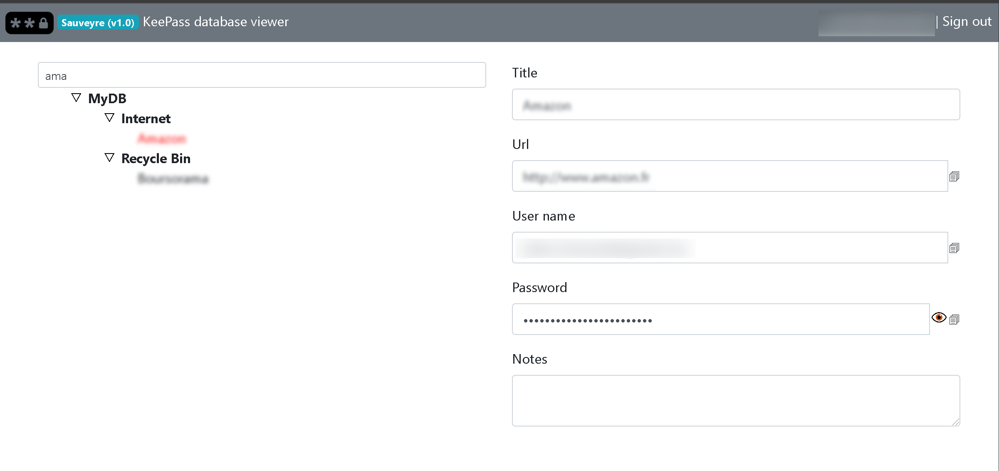
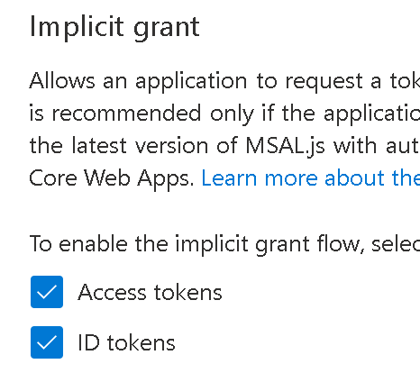

# Sauveyre: KeePass DB viewer

This web application is a simple [KeePass](https://keepass.info/) database viewer



The KeePass database used is stored on OneDrive, and to simplify the process, it cannot be picked from the UI. It is a default value stored as a global parameter. This allows to ensure that it is always the same file used. It also allows to still use third party client from your desktop. Again, this app is readonly for a quick access from any machine / mobile.

# Installation

You have several option as the application can be stored in a container. In the procedure below I am using Azure to secure & host **Sauveyre**.

In order to load the database from OneDrive, we need to authenticate to our Personal Microsoft Account, and this is achieved with the [MSAL library](https://docs.microsoft.com/en-US/azure/active-directory/develop/msal-overview)

## Register on app on your azure tenant

1. Navigate to your Azure portal and log (or create a free access, all the Azure resources used are free ones)
2. Go to Azure Directory
3. On the left, click on App Registration
4. Click on New Registration on the top
5. Provide a name, and select the last option (for both Microsoft Personal accounts and organizational)
6. As a redirect URI, input 'http://localhost:3000' to test **Sauverye** locally. Once the application will be deployed on a real environment, we will have to add the redirect URL generated by Azure (or the custom one if you decide to use a custom URL if you possess one)
7. Click Register
8. Once registered, navigate to Authentication on the left, and make sure you select both Access token and ID Token.




Once these steps are done, write done the client id generataed for this registration, that you can found on the front page (Overview link on the left)

## Build the image

1. First, clone the repo on your machine

```sh
/> cd {wherever}
/> git clone https://github.com/jchomarat/sauveyre
```

2. copy the .env.sample for dev & prod

```sh
/> cd sauveyre
/> cp .env.sample .env
/> cp .env.sample .env-prod
```

3. Edit the .env file and add the value

```sh
# Client ID retrieved in previous steps 
oauthClientId=
# Or any other port if you want another one
oauthRedirectUri=http://localhost:3000
# Your Outlook.com account username, this will act as a basic permissions handler. Only you will have access to this app
allowed=jucho@hotmail.fr,
# Relative path to your database file on OneDrive, starting with '/'
dbPath=/myDB.kdbx
```

## Run deno server locally on WSL

Ensure first that deno is installed. If you are on Windows, my recommandation is to use WSL to do so:

1. [Activate WSL](https://docs.microsoft.com/en-US/windows/wsl/install-win10)
2. [Install deno](https://deno.land/)

You can now run **Sauveyre**

```sh
/> deno run --allow-env --allow-net --allow-read app.ts
```

If everything went good, you just see a basic page. Log in using the link on the top right corner. Once logged in, you should be prompt with the database password

**Please note** that today this app only supports password, not security file. The underlying [Kdbxweb library](https://github.com/keeweb/kdbxweb) that I use for it does indeed support security file, I just need to implement it.

## Build and run a docker image locally

You can build and run locally this app in a docker container. To proceed, execute the following command

```sh
/> docker build . --build-arg ENV=dev -t sauveyre:dev
```

This command will build an image named *sauveyre* with the *dev* tag. Injecting the argument *ENV=dev* ensure that the .env file will be used.

To run the container, execute

```sh
/> docker run -it --init --env PORT=80 -p 3000:80 sauveyre:dev
```

## Build and push a docker image to Azure

If you want **Sauveyre** to be accessible from the *web*, you need to host it somewhere. In the following, we will publish our image to Azure and use it in an App Service (a web application that will serve this container)

### Create an App service

We need first to create this app servie as we will need the URL generated for our .env file, as Redirect Uri

1. Navigate to your Azure portal, log in
2. Add a new resource called Web App for Container, give it a name (ex. mySauveyre)
3. Leave all settings by default
4. Once created, get from the Overview page its URL

While we are at it, we need to ensure that this Url is also in the App Registration that we did previously:

1. Navigate to your Azure portal and log
2. Go to Azure Directory
3. On the left, click on App Registration
4. Select the app you have created earlier
5. Nnavigate to Authentication on the left, and add the Url of the App service as Redirect Uri
6. Save!

### Create a Registry

The registry will be the resource to which we will publish our docker image. This image will then be *hooked* to the App Service previously created.

1. Navigate to your Azure portal, log in
2. Add a new resource called Azure Container Registry, give it a name (ex. myContainerReg)
3. Ensure to activate Admin mode under Access Key. Write down the user name and one of the password.

### Log to your registry

Now, go back to your desktop, and open [The New Window Terminal](https://github.com/microsoft/terminal) and run the following command (from your Sauveyre folder)

```sh
/> docker login {Your Registry name}.azurecr.io  -u {Registry username} -p {Registry password}
```

### Build and publish the image

Before building the image, we need to adapt the .env-prod file with the Redirect Uri that we got previously. 

```sh
# Client ID  
oauthClientId=
# App Servie URL
oauthRedirectUri=https://{App Service URL}
# Your Outlook.com account username, this will act as a basic permissions handler. Only you will have access to this app
allowed=jucho@hotmail.fr,
# Relative path to your database file on OneDrive, starting with '/'
dbPath=/myDB.kdbx
```

Now we build & publish the image for "prod"

```sh
/> docker build . --build-arg ENV=prod -t {Azure container Regisitry URI}/sauveyre:X
/> docker publish {Azure container Regisitry URI}/sauveyre:X
```

### Use the App service to serve this image

And finally, we just need to tell our app service to load this image. At this stage, we have two options, 

1. We can directly specify at the App service level which image to use. This raise a small issue to me, we also need to update settings to have our app listening on port 80
2. We use a docker-compose file, much more flexible for environement variables

```yaml
version: '3.7'
services:
  {NAME}:
    image: {ACR}.azurecr.io/{IMAGE}:{TAG}
    environment:
        - PORT=80
    ports:
        - '80:80'
```

# Licence

This project is under the [MIT licence](LICENSE).